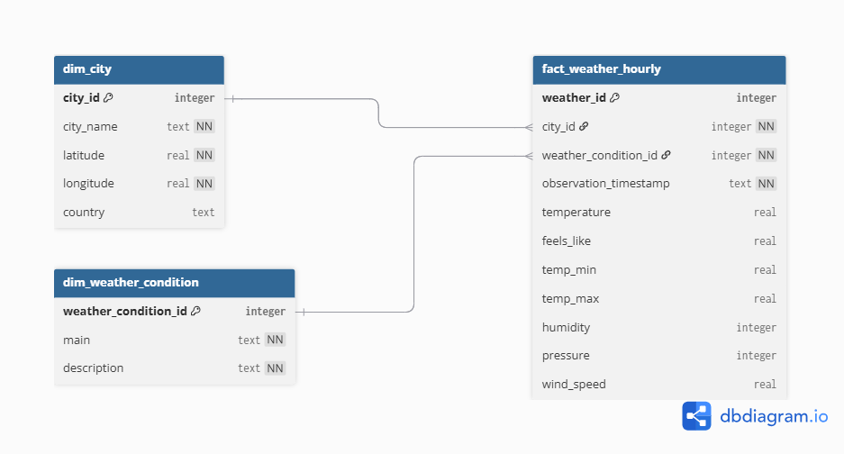

# 🌤️ Shopfully Weather Project

## 📌 Panoramica

Questo progetto implementa una **pipeline di raccolta, modellazione e caricamento** di dati meteo tramite **OpenWeather API**, con l’obiettivo di supportare analisi storiche e KPI per città.

Focus (stile Analytics/Data Engineering):

- separazione **raw vs curated**
- modello relazionale **fact + dimension**
- query SQL analitiche
- analisi con **pandas** su dataframe denormalizzato
- strategia di **incremental loading** robusta (ritardi + correzioni) con **UPSERT**

---

## 🎯 Obiettivo

Raccogliere dati meteo per alcune città italiane (Milano, Bologna, Cagliari) e renderli disponibili per:

- conteggio e ranking delle condizioni meteo nel tempo
- medie e massimi di temperatura
- variazioni giornaliere
- vento massimo

---

## ⚙️ Requisiti

- Python 3.12+
- Account OpenWeather (API key)

Dipendenze (`requirements.txt`):

- requests
- python-dotenv
- pandas
- sqlalchemy *(opzionale, per evoluzioni future)*

---

## 🔐 Configurazione

Creare un file `.env` nella root del progetto:

text
OPENWEATHER_API_KEY=<la_tua_api_key> 

📂 Struttura del progetto
shopfully_weather_project/
│
├── data/
│   ├── raw/                  # JSON grezzi dall'API (append-only)
│   ├── processed/            # (riservato a future trasformazioni)
│   └── weather.db            # SQLite database
│
├── docs/
│   └── logical_schema.png    # Schema logico (diagramma)
│
├── src/
│   ├── fetch_weather.py      # Estrazione (API → raw)
│   ├── load_to_db.py         # Load (raw → DB relazionale) + UPSERT
│   └── pandas_analytics.py   # Analisi con pandas (df denormalizzato)
│
├── sql/
│   ├── schema.sql            # DDL (tabelle + indici + vincoli)
│   └── queries.sql           # Query analitiche richieste (SQL)
│
├── .env.example
├── .gitignore
├── requirements.txt
└── README.md
Nota: .env reale non va mai committato. Usa .env.example come template.

🕐 Granularità 1-hour (Scheduling)

L’endpoint utilizzato è “current weather”: la granularità oraria viene ottenuta schedulando l’esecuzione di fetch_weather.py una volta per ora (snapshot orari).
Ogni snapshot viene salvato in data/raw/ e successivamente caricato in fact_weather_hourly, permettendo analisi storiche future.

▶️ Quickstart (esecuzione end-to-end)

Installare dipendenze:
pip install -r requirements.txt

Scaricare dati raw:
python src/fetch_weather.py

Caricare nel database (SQLite):
python src/load_to_db.py

Eseguire analisi con pandas:
python src/pandas_analytics.py

🧱 Step 1 — Data Modeling (concettuale)

Fonte dati

OpenWeather Current Weather API restituisce un JSON con:
città e coordinate
condizioni meteo (categoria + descrizione)
temperatura e metriche correlate
vento
timestamp di osservazione

Scelte di business/value

Per questo assessment vengono mantenuti i campi più utili per analytics:
timestamp (UTC)
città
temperatura (temp, min, max, feels_like)
condizione meteo (main, description)
vento (wind_speed)

Altri campi (pressione/visibilità/alba-tramonto ecc.) possono essere aggiunti in futuro.

Entità

dim_city: informazioni stabili sulla città
dim_weather_condition: catalogo condizioni (main + description)
fact_weather_hourly: osservazioni orarie (1 riga = 1 città + 1 timestamp)

Granularità: oraria.
Chiave naturale: (city_id, observation_timestamp).

🧾 Step 2 — Schema logico (visualizzato)

Diagramma disponibile in:

docs/logical_schema.png

🧩 Step 3 — Modello fisico (DDL)

Il DDL è in sql/schema.sql e crea:

dim_city
dim_weather_condition
fact_weather_hourly

Note importanti:

fact_weather_hourly include UNIQUE(city_id, observation_timestamp) per supportare UPSERT e ricarichi idempotenti.
observation_timestamp è salvato come ISO-8601 UTC (stringa) per compatibilità con SQLite/Python 3.12.
Sono presenti indici per supportare query analitiche (timestamp, city, condition).

🛰️ Step 4 — Estrazione e Raw layer

Script: src/fetch_weather.py

chiama OpenWeather per Milano/Bologna/Cagliari
salva ogni risposta come JSON in data/raw/ (append-only) con timestamp UTC
log in italiano

Esecuzione:

python src/fetch_weather.py

Output: file JSON raw in data/raw/.

🗄️ Step 5 — Caricamento su database (SQLite) + UPSERT

Script: src/load_to_db.py

esegue il DDL (sql/schema.sql) in modo idempotente
carica dimensioni (city, weather_condition)
carica la fact con UPSERT su (city_id, observation_timestamp) usando:

INSERT ... ON CONFLICT(city_id, observation_timestamp) DO UPDATE

Esecuzione:
python src/load_to_db.py

⚠️ Se stavi usando uno schema precedente senza vincolo UNIQUE, per applicare il vincolo puoi ricreare il DB:

Remove-Item data/weather.db
python src/load_to_db.py

📊 Step 6 — Query SQL richieste

File: sql/queries.sql

Le query rispondono a:

condizioni distinte nel periodo
ranking condizioni per città
temperatura media per città
città con temperatura massima assoluta
città con maggiore variazione giornaliera
città con vento massimo

🐼 Step 7 — Analisi con pandas (dataframe denormalizzato)

Script: src/pandas_analytics.py

legge il database SQLite
fa JOIN tra fact e dimension
crea un dataframe denormalizzato
calcola le stesse metriche richieste nel PDF usando groupby, nunique, mean, max, ecc.

Esecuzione:

python src/pandas_analytics.py

Metriche calcolate:

Numero di condizioni meteo distinte
Ranking delle condizioni meteo per città
Temperatura media per città
Città con temperatura massima assoluta
Città con maggiore variazione giornaliera di temperatura
Città con vento massimo

⭐ Step 8 (OBBLIGATORIO) — Incremental loading, ritardi e correzioni
Obiettivo

Garantire un carico incrementale affidabile con:

ritardi (late arriving data)
correzioni entro una finestra massima di 3 giorni

Strategia

Watermark: mantenere last_successful_hour_utc (checkpoint)
Lookback window per ritardi: ad ogni run ricaricare almeno le ultime N ore (es. 3 ore)
Correction window per correzioni: ricaricare sempre anche le ultime 72 ore (3 giorni)
Applicare UPSERT su chiave naturale (city_id, observation_timestamp)

Tecnica

raw = append-only (audit/tracciabilità)
fact = tabella “current truth” mantenuta con UPSERT (idempotente)

Questa combinazione rende il sistema:

idempotente
automatizzabile
consistente nel tempo

✅ Validazione (prove pratiche)

Sono stati eseguiti test per verificare:

1) Idempotenza / assenza duplicati
Rieseguire load_to_db.py non aumenta il numero di record nella fact.
2) Correzioni automatiche (UPSERT)
Forzando un valore errato (es. temperature = 999) e rieseguendo load_to_db.py,
i valori vengono sovrascritti e tornano consistenti con i dati raw.

🚀 Estensioni future (scalabilità)

Il progetto è progettato per crescere e includere:

tutte le municipalità italiane e oltre (tabella città scalabile)
nuove modalità di chiamata (stesso endpoint / parametri diversi)
trasformazioni in data/processed (curated layer)
scheduler (es. job orario) + watermark persistito

✅ Stato finale

✔️ Estrazione API funzionante + raw JSON
✔️ Schema SQL idempotente + vincolo UNIQUE
✔️ Caricamento su SQLite con UPSERT (idempotente)
✔️ Query SQL analitiche richieste
✔️ Analisi con pandas su dataframe denormalizzato
✔️ Strategia robusta per incremental loading + ritardi + correzioni
✔️ Schema logico visualizzato (docs/logical_schema.png)

📌 Progetto completato come deliverable per l’assessment Data Analytics Engineering.

